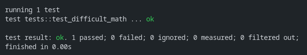
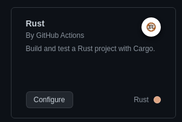
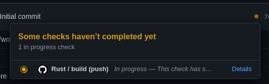

Are you a lazy human like me? Great because then this is for you.

[XClicker](https://github.com/robiot/xclicker) has existed for some time now and everytime I would create a new release, I would go through the same flow:
1.  Change the version in the makefile
2.  Update version in packages and code with `make version`
4.  Push to Github
5.  Create new release
6.  Build AppImage and deb package.
7.  Upload assets.

Being tired of doing the same procedure for every release and needing to build for other architectures, I created a workflow to do everything for me.

Before creating the release workflow, let's explain what the h*ll Github actions, workflows, and CI/CD is, and how to use them. (If you feel very big brain you can scroll straight to `Creating releases with Github Actions`)

# What is CI/CD?
CI/CD stands for **Continuous Integration/Continuous Delivery**. The XClicker workflow used a mix of both since the code gets compiled automatically (CI) and released (CD). Basically CI/CD is for automating tasks, and a workflow is the work CI/CD should do.

CI/CD is very often used for automating [unit tests](https://en.wikipedia.org/wiki/Unit_testing) (ex. jest, cargo). An example [is this rust workflow](https://github.com/robiot/zash/blob/main/.github/workflows/rust.yml) that builds, runs, and tests check code formatting every time a push to master happens, or when a pull request is opened.

```yml
name: Rust

on:
  push:
    branches: [ master ]
  pull_request:
    branches: [ master ]

env:
  CARGO_TERM_COLOR: always

jobs:
  build:

    runs-on: ubuntu-latest

    steps:
    - uses: actions/checkout@v2
    - name: Build
      run: cargo build --verbose
    - name: Test command
      run: cargo run -- -c "echo test"
    - name: Run tests
      run: cargo test
    - name: Clippy
      run: cargo clippy --workspace -- -D warnings
```

# Using CI/CD
Github provides a very **epic** way of automating your workflows with **Github Actions**. There are also CI/CD pipelines for other services like Azure Repos.

Let's create an incredibly simple rust application with some tests and a workflow.

```
➜ cargo new rust-simple-workflow
```

Create a function called calculate_difficult_math like this and use it in the main function.

```rust
fn calculate_difficult_math(a: i32, b: i32) -> i32 {
	a + b
}

fn main() {
	println!("Hello, world! {}", calculate_difficult_math(5, 5));
}
```

Now run the app and it should output something like this.


Now we can create a module called tests with a function called test_difficult_math.
```rust
#[cfg(test)]
mod tests {
    // Importing all functions in the super scope
    use super::*;

    #[test]
    fn test_difficult_math() {
        // Panics if the left value is not equals to the right
        assert_eq!(calculate_difficult_math(10, 5), 15);
    }
}

```



Full file
```rust
fn calculate_difficult_math(a: i32, b: i32) -> i32 {
    a + b
}

fn main() {
    println!("Hello, world! {}", calculate_difficult_math(5, 5));
}

#[cfg(test)]
mod tests {
    // Importing all functions in the super scope
    use super::*;

    #[test]
    fn test_difficult_math() {
        // Panics if the left value is not equals to the right
        assert_eq!(calculate_difficult_math(10, 5), 15);
    }
}
```

Create a repository on Github with a readme, so it sets a main branch. Then press **Actions** and search Rust  `/actions/new?category=none&query=Rust`. This is a simple way for getting started with a simple workflow template. Then click Configure
.

Then press `Start commit` and `Commit new file`.
Now the workflow is finished. 

Now initialize a Github repository in rust-simple-workflow and push it to Github.

```
git init
git remote add origin https://github.com/username/repo
git pull origin master # Or HEAD:main
git add .
git commit -m "Initial commit"
git push origin master # Or HEAD:main
```

Now go to the Github repository and you will see a small yellow dot. Press this and then `Details`. Here you will be presented with everything that is going on in the workflow.


Hopefully, everything succeeded. And this is how to make a simple CI unit testing workflow.

# Creating releases with Github Actions
Now to the fun part, let's create a workflow to automate releasing the rust project created before.

Open up the `.github/workflows/rust.yml` locally. Most stuff will be replaced here, but you can also create a new file called something along the lines of `release.yml`.

Here is the new content. The comments should describe what happens.

```yml
# Everytime a new tag is created that starts with v, It will run this action
on:
  push:
    tags:
      - 'v*'

name: Create Release

env:
  CARGO_TERM_COLOR: always

jobs:
  build:
    runs-on: ubuntu-latest

    steps:
    - uses: actions/checkout@v3

    # First check that tests succeed 
    - name: Run tests
      run: cargo test --verbose

    # Build it
    - name: Build
      run: cargo build --verbose --release

    # Create a github release with automatic generated release notes
    - name: Create Release
      uses: softprops/action-gh-release@v0.1.14
      env:
        GITHUB_TOKEN: ${{ secrets.GITHUB_TOKEN }}
      with:
        generate_release_notes: true
        draft: false
        prerelease: false
        files: |
          target/release/rust-simple-workflow
```

You can create a new tag that starts with v and push it now when you have this workflow.

```
git tag v1.0.0
git push origin --tags
```

Now go to the Github repository and you will see the yellow dot again. Click details and you will be presented with what happens. After a bit of time, you will see a new release is created by **github-actions** with the compiled asset. Now, this is just for the platform the ubuntu container is running, which in this case is amd64. If you would like to build it for other platforms you would have to look into [cross](https://github.com/cross-rs/cross) or [uraimo/run-on-arch-action](https://github.com/uraimo/run-on-arch-action) (used for [XClicker](https://github.com/robiot/xclicker/blob/master/.github/workflows/release.yml))

\
Thanks for reading and I hope you learned something new!
